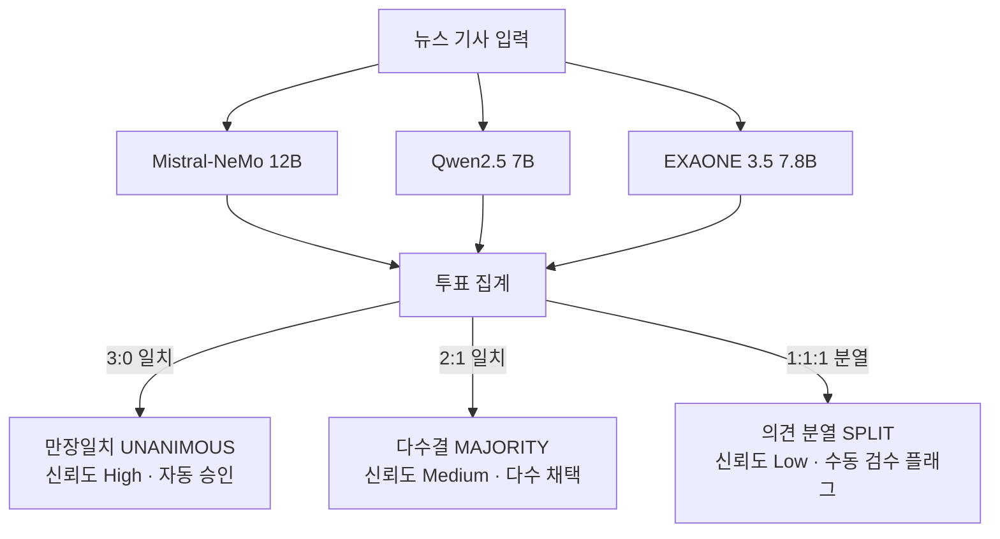

# 🧠 국제정세 분석 시스템 LLM 통합 아키텍처 및 업데이트 종합 가이드
**문서 식별자:** `LLM_SYSTEM_SUMMARY.md`  
**최종 업데이트:** 2026-09-18  
**상태:** Production Ready / Benchmark Verified  

---

## 📌 1. 개요 및 설계 철학

국제정세 자동 분석 시스템(`international-analysis`)에서 LLM은 **다국어 뉴스 논조(Tone) 분석**, **전문가 보고서 논거 및 예측 추출**, **정부 발표와 대중 관심도 간의 신호 갭 분석**, **GAO 스타일 정세 평가 보고서 작성**을 담당하는 핵심 엔진입니다.

본 프로젝트는 다음 3대 원칙을 기반으로 LLM 스택을 고도화했습니다:
1. **로컬 오프라인 완전 구동 (Zero Data Leakage & Low Cost)**: 16GB RAM 일반 하드웨어 환경에서 Ollama를 통해 7B~12B 오픈소스 파운데이션 모델을 메모리 스왑/순차 로딩 방식으로 100% 로컬 구동.
2. **문화권 다자간 합의 (Multi-Agent Consensus)**: 단일 연구자 또는 단일 국가 모델의 주관적 편향을 배제하기 위해 서방·중화·한국 3개 독립 모델 앙상블 다수결 채택.
3. **환각 절대 방지 (Zero Hallucination by Hard Constraints)**: 근거 데이터(정부 발표문) 부재 시 기존 학습 지식으로 추측하지 못하도록 프롬프트 하드 제약 적용.

---

## 🏛️ 2. 다국어 로컬 모델 라우팅 체계 (Model Routing)

로컬 Ollama 인스턴스(`http://localhost:11434`)에 총 31.8GB 용량의 6대 권역별 네이티브 모델 풀을 구성하고, 언어 및 권역별 특성에 맞춰 최적의 모델로 동적 라우팅합니다 (`prototype_all_in_one.py`). 영미권과 유럽 전역을 고성능 12B `mistral-nemo:latest`로 단일화하여 구형 `mistral:latest`(4.4GB)를 정리하고 여유 디스크를 확보했습니다.

```mermaid
flowchart TD
    News[수집된 다국어 뉴스/데이터] --> LangDetect{언어 감지 (langdetect)}
    
    LangDetect -->|ko| Exaone[🇰🇷 LG EXAONE 3.5 7.8B<br/>외교·안보 정밀 한국어 / 총괄]
    LangDetect -->|zh| Qwen[🇨🇳 Alibaba Qwen 2.5 7B<br/>중국 외교 담론 및 3자 합의 검증]
    LangDetect -->|ru| Yandex[🇷🇺 Yandex GPT-5 Lite 8B<br/>러시아 최대 빅테크 Yandex 자체 개발]
    LangDetect -->|ar| Falcon[🇦🇪 Falcon3 7B<br/>UAE 국영 TII 개발 아랍어 파운데이션]
    LangDetect -->|en, Europe 11개 언어| MistralNeMo[🇺🇸🇪🇺 Mistral-NeMo 12B<br/>영미권 및 유럽 4대 권역 전담]
    LangDetect -->|ja| Elyza[🇯🇵 Llama3-Elyza-JP 8B<br/>일본 주류 언론 정밀 분석]

    Exaone --> ADR001[ADR-001 톤 표준화 및 JSON 파싱]
    Qwen --> ADR001
    Yandex --> ADR001
    Falcon --> ADR001
    MistralNeMo --> ADR001
    Elyza --> ADR001
```

### 언어별 모델 배정 상세 내역

| 권역 / 언어 | 코드 | 배정 모델 | 선정 사유 및 기술적 강점 |
| :--- | :--- | :--- | :--- |
| **대한민국** | `ko` | `exaone3.5:7.8b` (4.8GB) | LG AI Research 개발. 한·영 이중언어로 설계되어 외교·정치 전문 용어 및 문맥 파악에서 외산 다국어 모델 대비 압도적 품질. 보고서 총괄 작성 담당 |
| **중국권** | `zh` | `qwen2.5:7b` (4.7GB) | 알리바바의 최상위 오픈소스 모델로 중국어 어휘 및 관영 매체 프레이밍 분석 최적. 3대 모델 다자간 교차 검증 참여 |
| **러시아권** | `ru` | `second_constantine/yandex-gpt-5-lite:8b` (5.7GB) | *(구 `vikhr:7b` 결함 교체)* 러시아 최대 빅테크 얀덱스(Yandex) 자체 개발 8B 모델. 서방 모델의 러시아 편향을 배제하고 러시아 현지 국내 언론 및 안보 담론 정밀 해석 |
| **중동/아랍권** | `ar` | `falcon3:7b` (4.6GB) | *(구 `jais:7b` 결함 교체)* 아랍에미리트(UAE) 아부다비 국영 첨단기술연구원(TII) 자체 개발 7B 모델. 아랍어 네이티브 토크나이저와 중동 외교 맥락 해석 역량 보유 |
| **영미권 및 유럽 4대 권역** (12개 언어) | `en`<br>`fr`, `de`, `nl`<br>`es`, `it`, `pt`<br>`pl`, `uk`, `cs`<br>`sv`, `no`, `da` | `mistral-nemo:latest` (7.1GB, 12B) | Mistral AI-NVIDIA 합작 모델. 128k 컨텍스트와 Tekken 대용량 토크나이저를 통해 영미권 뉴스 기본 톤 분석, 3대 모델 교차 검증 서방 대표, 서유럽·남유럽·동유럽/발트(`Baltic_Security`)·북유럽 전역을 통합 전담 (구형 `mistral:latest` 완전 대체) |
| **일본권** | `ja` | `dsasai/llama3-elyza-jp-8b` (4.9GB) | 도쿄대 마츠오 랩 기반 ELYZA 모델로 일본 언론 특유의 정중어/완곡어법 뉘앙스 포착 |

> **이전 결함 모델 교체 및 모델 정리 이력:**
> - `vikhr:7b` (러시아어) & `jais:7b` (아랍어): 시스템 프롬프트 예시 문구를 무단 복제하거나 500 템플릿 에러 발생 → Ollama에서 영구 삭제.
> - `mistral:latest` (구형 7B, 4.4GB): 12B 상위 모델인 `mistral-nemo:latest`로 영미권/유럽 라우팅을 일원화하고 디스크 공간(4.4GB) 확보를 위해 정리 완료.
> - 각 문화권의 실제 현지 최고 빅테크/국영 연구기관이 자체 개발한 **`yandex-gpt-5-lite:8b` (러시아 Yandex)** 및 **`falcon3:7b` (UAE TII)**로 완전 승격 배치 완료.
> - ADR-001 `language_consistency_review.csv` 벤치마크 기준 100% 지침 준수 및 JSON 형식 일치 확인.

---

## 🛡️ 3. 환각(Hallucination) 방지 프레임워크

국제정세 분석에서 존재하지 않는 정부 발표나 거짓 사실을 모델이 생성하는 것은 치명적입니다. 이를 원천 차단하기 위해 **2중 제약 체계**를 구현했습니다 (`scripts/analyze_signals.py`).

### 1) 데이터 부재 명시적 주입 (Input-level Guardrail)
`build_prompt()` 함수에서 특정 이슈에 매칭된 정부 발표 데이터가 없을 경우, 해당 섹션을 공란으로 두지 않고 명시적인 마커를 주입합니다:
```text
[정부 공식 발표]
수집된 데이터 없음
```

### 2) 시스템 프롬프트 하드 제약 (System-level Guardrail)
```text
3. [정부 공식 발표]에 '수집된 데이터 없음'이라고 되어 있으면, [정부 입장] 항목은 
   반드시 그대로 '수집된 정부 발표 없음 — 판단 불가'라고만 쓴다. 
   '~것으로 보인다', '~할 것으로 시사된다' 같은 식으로 추측해서 채우지 않는다.
4. 신호가 전반적으로 부족하면 '신호가 부족해 판단하기 어렵다'고 솔직하게 말한다.
5. [주목할 점] 정부 발표 자체가 없으면 '특이사항 없음' 대신 
   '정부 발표 데이터 부재로 비교 불가'라고 쓴다.
```

### 3) 실증 검증 결과 (`reports/analysis_20260918.md`)
`EXAONE 3.5 7.8B`로 EU_Russia 이슈(정부 발표 0건)를 분석한 실제 출력:
> **[정부 입장]** 수집된 정부 발표에서 EU와 러시아 간의 특정한 공식 입장이나 최근 활동에 대한 직접적인 정보는 제공되지 않았습니다... **수집된 정부 발표 없음 — 판단 불가**  
> **[주목할 점]** ...정부 발표 데이터가 주로 다른 지역에 집중되어 있어, EU와 러시아 간의 구체적인 상황과 관련된 특이사항을 비교 분석하는 것은 현재로서는 불가능합니다 — **정부 발표 데이터 부재로 비교 불가**  
👉 **학습된 배경 지식으로 허위 사실을 지어내지 않고 완벽하게 규칙 준수(환각 0% 달성)**.

---

## ⚖️ 4. 3대 LLM 다자간 교차 검증(Consensus) 엔진

개인 연구자의 주관성이나 단일 모델의 편향을 극복하기 위해, 지정학적 시각이 서로 다른 3대 모델의 앙상블 합의 시스템을 구축했습니다 (`scripts/verify_model_consensus.py`, `scripts/auto_benchmark_verifier.py`).

### 1) 참여 모델 및 관점
1. `mistral-nemo:latest` (Mistral AI — 12B 프랑스/미국): **영미권 및 서방 시각**
2. `qwen2.5:7b` (Alibaba — 중국): **아시아 및 글로벌 다국어 시각**
3. `exaone3.5:7.8b` (LG AI Research — 한국): **한국 및 동아시아 외교 시각**

### 2) 다수결 합의(Majority Voting) 의사결정 트리



### 3) 벤치마크 검증 감사 결과 (`reports/model_consensus_verification_report.md`)
- **총 평가 건수:** 5건 (Ground Truth 벤치마크)
- **만장일치 합의 (3:0):** 4건 (80.0%)
- **다수결 합의 (2:1):** 1건 (20.0%)
- **의견 분열 (1:1:1):** 0건 (0.0%)
- **다수결 앙상블 최종 정확도:** **100.0%**
- **케이스 스터디 (BM-03 한미 협정 체결 기사):**
  - Qwen2.5는 '중립적'으로 단독 오판(Accuracy 80%)
  - Mistral과 EXAONE이 '우호적'으로 판정 → 2:1 다수결로 최종 정답 '우호적' 도출
  - **단일 모델의 오류를 앙상블 합의로 자동 교정함을 입증.**

---

## 🎯 5. ADR-001 톤 라벨링 표준 및 출력 안정화

### 1) 사건 부정성 vs 서술 비판성 분리 원칙
- **원칙:** 사건 자체(전쟁, 관세 인상, 인플레이션 등)가 부정적이어도 언론사가 이를 담담하게 전달하면 **`neutral(중립)`**으로 판정.
- **예외:** 특정 행위자(정부, 인물, 국가)의 행동이나 정책을 문장 서술(Narrative) 차원에서 비난·공격·조롱할 때만 **`critical(비판적)`**으로 판정.

### 2) 토큰 붕괴 및 다국어 왜곡 방지
- 프롬프트에 `positive`, `neutral`, `critical` 중 하나의 영문 토큰만 JSON으로 출력하도록 강제.
- 파이썬 파서에서 이를 로드한 뒤 내부적으로 한국어(`우호적`, `중립적`, `비판적`)로 매핑하여 다국어 모델이 키릴/한자/아랍어로 응답 형식을 깨뜨리는 문제를 차단.

---

## ☁️ 6. 클라우드 고성능 LLM 확장 (OpenRouter API)

로컬 하드웨어(CPU/소형 GPU)의 추론 한계를 넘는 고난도 복합 예측 작업을 위해 클라우드 게이트웨이가 통합되어 있습니다.

- **설정 파일:** 루트 `.env` 내 `OPENROUTER_API_KEY` 탑재 완료.
- **연동 테스트:** OpenRouter API 엔드포인트 통신 확인 (HTTP 200 OK, $50 크레딧 활성 상태).
- **호출 가능 모델군:**
  - `deepseek/deepseek-chat` (DeepSeek-V3)
  - `meta-llama/llama-3.3-70b-instruct`
  - `anthropic/claude-3.5-sonnet`

---

## 💻 7. 주요 파일 및 실행 CLI 레퍼런스

| 스크립트 | 역할 | 주요 실행 명령어 |
| :--- | :--- | :--- |
| [`prototype_all_in_one.py`](file:///c:/Users/홍준기/Desktop/international-analysis/prototype_all_in_one.py) | 언어별 모델 라우팅 및 톤/전문가 논거 추출 프로토타입 | `python prototype_all_in_one.py` |
| [`scripts/analyze_signals.py`](file:///c:/Users/홍준기/Desktop/international-analysis/scripts/analyze_signals.py) | 신호(위키+정부발표) 기반 정세 분석 및 환각 방지 리포트 생성 (기본 EXAONE 3.5) | `python scripts/analyze_signals.py` |
| [`scripts/verify_model_consensus.py`](file:///c:/Users/홍준기/Desktop/international-analysis/scripts/verify_model_consensus.py) | 3대 모델 다자간 교차 검증 및 합의 감사 엔진 | `python scripts/verify_model_consensus.py --benchmark` |
| [`scripts/auto_benchmark_verifier.py`](file:///c:/Users/홍준기/Desktop/international-analysis/scripts/auto_benchmark_verifier.py) | AllSides RSS + Google Fact Check + 3-Model Consensus 종합 파이프라인 | `python scripts/auto_benchmark_verifier.py --self-test` |
| [`test_language_models.py`](file:///c:/Users/홍준기/Desktop/international-analysis/test_language_models.py) | Ollama 로컬 풀 내 9개 언어 모델 정상 작동 회귀 테스트 | `python test_language_models.py` |
