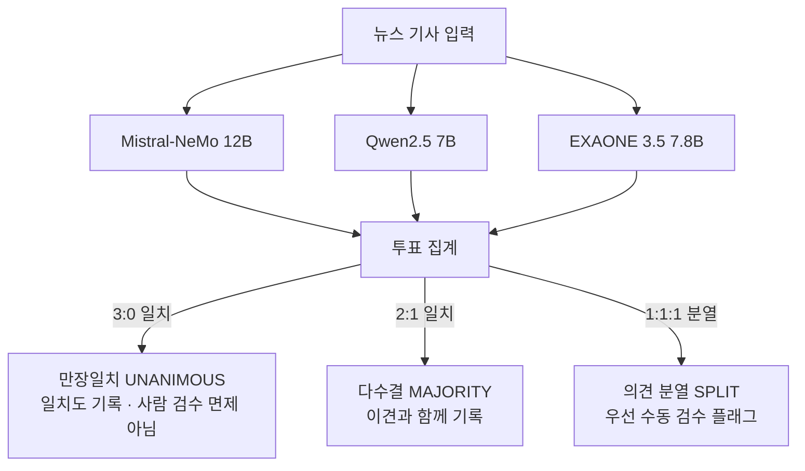

# 🧠 국제정세 분석 시스템 LLM 통합 아키텍처 및 업데이트 종합 가이드
**문서 식별자:** `LLM_SYSTEM_SUMMARY.md`  
**최종 업데이트:** 2026-09-21  
**상태:** 프로토타입 / 사람 검수·백테스트 체계 구축 중  

---

## 📌 1. 개요 및 설계 철학

국제정세 자동 분석 시스템(`international-analysis`)에서 LLM은 **다국어 뉴스 논조(Tone) 분석**, **전문가 보고서 논거 및 위험 신호 추출**, **정부 발표와 대중 관심도 간의 신호 갭 분석**, **조기경보 대시보드 및 정세 평가 보고서 작성**을 담당하는 핵심 엔진입니다.

> **현재 방향:** 초기에는 미래 국제정세 사건 예측을 목표로 했지만, 정답 정의와 장기 검증 부담이 커서 현재는 **AI 기반 국제정세 및 공급망 리스크 조기경보 시스템**으로 피벗했습니다. 예측 접근의 폐기 사유와 재사용 자산은 `docs/history/PROJECT_EVOLUTION_TIMELINE.md`와 `docs/history/PREDICTION_APPROACH_RETIRED.md`에 보존합니다.

본 프로젝트는 다음 3대 원칙을 기반으로 LLM 스택을 고도화했습니다:
1. **로컬 오프라인 완전 구동 (Zero Data Leakage & Low Cost)**: 16GB RAM 일반 하드웨어 환경에서 Ollama를 통해 7B~12B 오픈소스 파운데이션 모델을 메모리 스왑/순차 로딩 방식으로 100% 로컬 구동.
2. **다중 모델 비교 (Multi-model Comparison)**: 서로 다른 개발사의 모델 출력을 비교하고, 일치·불일치를 사람 검수 우선순위로 사용한다. 개발 국가나 합의가 정치적 관점의 독립성·정답을 보장하지는 않는다.
3. **근거 부재 시 보류 (Evidence-aware Abstention)**: 정부 발표문이 없을 때 판단 보류를 요구하는 프롬프트 제약을 둔다. 이 제약은 환각 위험을 줄이기 위한 장치이며 환각을 완전히 제거한다고 주장하지 않는다.

---

## 🏛️ 2. 다국어 로컬 모델 라우팅 체계 (Model Routing)

로컬 Ollama 인스턴스(`http://localhost:11434`)에 총 31.8GB 용량의 6대 권역별 네이티브 모델 풀을 구성하고, 언어 및 권역별 특성에 맞춰 최적의 모델로 동적 라우팅합니다 (`prototype_all_in_one.py`). 영미권과 유럽 전역을 고성능 12B `mistral-nemo:latest`로 단일화하여 구형 `mistral:latest`(4.4GB)를 정리하고 여유 디스크를 확보했습니다.

```mermaid
flowchart TD
    News[수집된 다국어 뉴스/데이터] --> LangDetect{언어 감지 (langdetect)}
    
    LangDetect -->|ko| Exaone[🇰🇷 LG EXAONE 3.5 7.8B<br/>외교·안보 정밀 한국어 / 총괄]
    LangDetect -->|zh| Qwen[🇨🇳 Alibaba Qwen 2.5 7B<br/>중국 외교 담론 및 3자 합의 검증]
    LangDetect -->|ru| Yandex[🇷🇺 Yandex GPT-5 Lite 8B<br/>러시아 최대 빅테크 Yandex 자체 개발]
    LangDetect -->|ar| Falcon[🇦🇪 Falcon3 7B<br/>UAE 국영 TII 개발 아랍어 파운데이션]
    LangDetect -->|en, Europe 11개 언어| MistralNeMo[🇺🇸🇪🇺 Mistral-NeMo 12B<br/>영미권 및 유럽 4대 권역 전담]
    LangDetect -->|ja| Elyza[🇯🇵 Llama3-Elyza-JP 8B<br/>일본 주류 언론 정밀 분석]

    Exaone --> ADR001[ADR-001 톤 표준화 및 JSON 파싱]
    Qwen --> ADR001
    Yandex --> ADR001
    Falcon --> ADR001
    MistralNeMo --> ADR001
    Elyza --> ADR001
```

### 언어별 모델 배정 상세 내역

| 권역 / 언어 | 코드 | 배정 모델 | 선정 사유 및 기술적 강점 |
| :--- | :--- | :--- | :--- |
| **대한민국** | `ko` | `exaone3.5:7.8b` (4.8GB) | LG AI Research 개발. 한·영 이중언어로 설계되어 외교·정치 전문 용어 및 문맥 파악에서 외산 다국어 모델 대비 압도적 품질. 보고서 총괄 작성 담당 |
| **중국권** | `zh` | `qwen2.5:7b` (4.7GB) | 알리바바의 최상위 오픈소스 모델로 중국어 어휘 및 관영 매체 프레이밍 분석 최적. 3대 모델 다자간 교차 검증 참여 |
| **러시아권** | `ru` | `second_constantine/yandex-gpt-5-lite:8b` (5.7GB) | 러시아 최대 빅테크 얀덱스(Yandex) 자체 개발 8B 모델. 서방 모델의 러시아 편향을 배제하고 러시아 현지 국내 언론 및 안보 담론 정밀 해석 (설치 및 검증 완료) |
| **중동/아랍권** | `ar` | `falcon3:7b` (4.6GB) | 아랍에미리트(UAE) 아부다비 국영 첨단기술연구원(TII) 자체 개발 7B 모델. 아랍어 네이티브 토크나이저와 중동 외교 맥락 해석 역량 보유 (**2026-09-21 설치 및 추론 정상 검증 완료**) |
| **영미권 및 유럽 4대 권역** (12개 언어) | `en`<br>`fr`, `de`, `nl`<br>`es`, `it`, `pt`<br>`pl`, `uk`, `cs`<br>`sv`, `no`, `da` | `mistral-nemo:latest` (7.1GB, 12B) | Mistral AI-NVIDIA 합작 모델. 128k 컨텍스트와 Tekken 대용량 토크나이저를 통해 영미권 뉴스 기본 톤 분석, 3대 모델 교차 검증 서방 대표, 서유럽·남유럽·동유럽/발트(`Baltic_Security`)·북유럽 전역을 통합 전담 (구형 `mistral:latest` 완전 대체) |
| **일본권** | `ja` | `dsasai/llama3-elyza-jp-8b` (4.9GB) | 도쿄대 마츠오 랩 기반 ELYZA 모델로 일본 언론 특유의 정중어/완곡어법 뉘앙스 포착 |

> **이전 결함 모델 교체 및 모델 정리 이력:**
> - `vikhr:7b` (러시아어) & `jais:7b` (아랍어): 시스템 프롬프트 예시 문구를 무단 복제하거나 500 템플릿 에러 발생 → Ollama에서 영구 삭제.
> - `mistral:latest` (구형 7B, 4.4GB): 12B 상위 모델인 `mistral-nemo:latest`로 영미권/유럽 라우팅을 일원화하고 디스크 공간(4.4GB) 확보를 위해 정리 완료.
> - 각 문화권의 실제 현지 최고 빅테크/국영 연구기관이 자체 개발한 **`yandex-gpt-5-lite:8b` (러시아 Yandex)** 및 **`falcon3:7b` (UAE TII)**로 완전 승격 배치 완료.
> - ADR-001의 고정 예시는 출력 형식 회귀 점검에 사용한다. 제한된 예시의 일치율은 일반 성능이나 언어별 품질을 보장하지 않는다.

---

## 🛡️ 3. 환각(Hallucination) 방지 프레임워크

국제정세 분석에서 존재하지 않는 정부 발표나 거짓 사실을 모델이 생성하는 것은 치명적입니다. 이를 원천 차단하기 위해 **2중 제약 체계**를 구현했습니다 (`scripts/analyze_signals.py`).

### 1) 데이터 부재 명시적 주입 (Input-level Guardrail)
`build_prompt()` 함수에서 특정 이슈에 매칭된 정부 발표 데이터가 없을 경우, 해당 섹션을 공란으로 두지 않고 명시적인 마커를 주입합니다:
```text
[정부 공식 발표]
수집된 데이터 없음
```

### 2) 시스템 프롬프트 하드 제약 (System-level Guardrail)
```text
3. [정부 공식 발표]에 '수집된 데이터 없음'이라고 되어 있으면, [정부 입장] 항목은 
   반드시 그대로 '수집된 정부 발표 없음 — 판단 불가'라고만 쓴다. 
   '~것으로 보인다', '~할 것으로 시사된다' 같은 식으로 추측해서 채우지 않는다.
4. 신호가 전반적으로 부족하면 '신호가 부족해 판단하기 어렵다'고 솔직하게 말한다.
5. [주목할 점] 정부 발표 자체가 없으면 '특이사항 없음' 대신 
   '정부 발표 데이터 부재로 비교 불가'라고 쓴다.
```

### 3) 예시 출력 기록 (`docs/archive/pre_pivot_validation_outputs/analysis_20260918.md`)
`EXAONE 3.5 7.8B`로 EU_Russia 이슈(정부 발표 0건)를 분석한 실제 출력:
> **[정부 입장]** 수집된 정부 발표에서 EU와 러시아 간의 특정한 공식 입장이나 최근 활동에 대한 직접적인 정보는 제공되지 않았습니다... **수집된 정부 발표 없음 — 판단 불가**  
> **[주목할 점]** ...정부 발표 데이터가 주로 다른 지역에 집중되어 있어, EU와 러시아 간의 구체적인 상황과 관련된 특이사항을 비교 분석하는 것은 현재로서는 불가능합니다 — **정부 발표 데이터 부재로 비교 불가**  
👉 이 사례에서는 지정된 "데이터 없음" 조건에 대해 판단 보류 문구가 출력되었다. 단일 사례는 일반적인 환각률이나 규칙 준수율을 입증하지 않는다.

---

## ⚖️ 4. 3대 LLM 출력 비교(Consensus) 엔진

서로 다른 개발사의 3대 모델 출력을 함께 기록하는 비교 도구를 구축했습니다 (`scripts/verify_model_consensus.py`, `scripts/auto_benchmark_verifier.py`). 합의는 정답·객관성·전문가 검증의 대체물이 아니며, 불일치 사례와 근거 부족 사례를 사람 검수로 보내기 위한 신호입니다.

### 1) 참여 모델 및 관점
1. `mistral-nemo:latest` (Mistral AI — 12B 프랑스/미국): **영미권 및 서방 시각**
2. `qwen2.5:7b` (Alibaba — 중국): **아시아 및 글로벌 다국어 시각**
3. `exaone3.5:7.8b` (LG AI Research — 한국): **한국 및 동아시아 외교 시각**

### 2) 다수결 합의(Majority Voting) 의사결정 트리



### 3) 고정 회귀 시나리오 점검
- **총 평가 건수:** 5건 (Ground Truth 벤치마크)
- **만장일치 합의 (3:0):** 4건 (80.0%)
- **다수결 합의 (2:1):** 1건 (20.0%)
- **의견 분열 (1:1:1):** 0건 (0.0%)
- 고정 5개 예시의 결과는 프롬프트·JSON 출력 변경 후의 회귀 점검용이다. 작성자가 정의한 예시와의 일치율을 독립 성능 또는 정확도로 해석하지 않는다.
- **케이스 스터디 (BM-03 한미 협정 체결 기사):**
  - Qwen2.5는 '중립적'으로 단독 오판(Accuracy 80%)
  - Mistral과 EXAONE이 '우호적'으로 판정 → 2:1 다수결로 최종 정답 '우호적' 도출
  - 이 사례는 모델 출력이 갈릴 수 있음을 보여준다. 앙상블이 오류를 자동 교정했다는 일반 결론으로 확장하지 않는다.

---

## 🎯 5. ADR-001 톤 라벨링 표준 및 출력 안정화

### 1) 사건 부정성 vs 서술 비판성 분리 원칙
- **원칙:** 사건 자체(전쟁, 관세 인상, 인플레이션 등)가 부정적이어도 언론사가 이를 담담하게 전달하면 **`neutral(중립)`**으로 판정.
- **예외:** 특정 행위자(정부, 인물, 국가)의 행동이나 정책을 문장 서술(Narrative) 차원에서 비난·공격·조롱할 때만 **`critical(비판적)`**으로 판정.

### 2) 토큰 붕괴 및 다국어 왜곡 방지
- 프롬프트에 `positive`, `neutral`, `critical` 중 하나의 영문 토큰만 JSON으로 출력하도록 강제.
- 파이썬 파서에서 이를 로드한 뒤 내부적으로 한국어(`우호적`, `중립적`, `비판적`)로 매핑하여 다국어 모델이 키릴/한자/아랍어로 응답 형식을 깨뜨리는 문제를 차단.

---

## ☁️ 6. 클라우드 고성능 LLM 확장 (OpenRouter API)

로컬 하드웨어(CPU/소형 GPU)의 추론 한계를 넘는 고난도 복합 예측 작업을 위해 클라우드 게이트웨이가 통합되어 있습니다.

- **설정 파일:** 루트 `.env` 내 `OPENROUTER_API_KEY` 탑재 완료.
- **연동 테스트:** OpenRouter API 엔드포인트 통신 확인 (HTTP 200 OK, $50 크레딧 활성 상태).
- **호출 가능 모델군:**
  - `deepseek/deepseek-chat` (DeepSeek-V3)
  - `meta-llama/llama-3.3-70b-instruct`
  - `anthropic/claude-3.5-sonnet`

---

## 💻 7. 주요 파일 및 실행 CLI 레퍼런스

| 스크립트 | 역할 | 주요 실행 명령어 |
| :--- | :--- | :--- |
| [`prototype_all_in_one.py`](file:///c:/Users/홍준기/Desktop/international-analysis/prototype_all_in_one.py) | 언어별 모델 라우팅 및 톤/전문가 논거 추출 프로토타입 | `python prototype_all_in_one.py` |
| [`scripts/analyze_signals.py`](file:///c:/Users/홍준기/Desktop/international-analysis/scripts/analyze_signals.py) | 신호(위키+정부발표) 기반 정세 분석 및 환각 방지 리포트 생성 (기본 EXAONE 3.5) | `python scripts/analyze_signals.py` |
| [`scripts/verify_model_consensus.py`](file:///c:/Users/홍준기/Desktop/international-analysis/scripts/verify_model_consensus.py) | 3대 모델 다자간 교차 검증 및 합의 감사 엔진 | `python scripts/verify_model_consensus.py --benchmark` |
| [`scripts/auto_benchmark_verifier.py`](file:///c:/Users/홍준기/Desktop/international-analysis/scripts/auto_benchmark_verifier.py) | AllSides RSS + Google Fact Check + 3-Model Consensus 종합 파이프라인 | `python scripts/auto_benchmark_verifier.py --self-test` |
| [`test_language_models.py`](file:///c:/Users/홍준기/Desktop/international-analysis/test_language_models.py) | Ollama 로컬 풀 내 9개 언어 모델 정상 작동 회귀 테스트 | `python test_language_models.py` |

---

## 🏛️ 8. 분석(Analysis) 전담 vs 출력(Output/Synthesis) 전담 LLM 이원화 아키텍처 (2026-09-21)

국제정세 분석 시스템은 **각 권역별 현지 분석관(Regional Analysis LLMs)**과 **최종 종합 보고서 작성관(Chief Intelligence Officer / Output LLM)**의 역할을 명확히 분리하는 다중 에이전트 계층 구조를 채택합니다.

```mermaid
flowchart TD
    subgraph DataCollection [1단계: 다원화 데이터 수집]
        D1[다국어 RSS / 언론 기사]
        D2[정부 공식 발표 RSS]
        D3[싱크탱크 및 현지 전문가 분석]
        D4[실증 여론조사 Pew / ECFR / Ipsos]
    end

    subgraph RegionalAnalysts [2단계: 권역별 현지 분석관 (분석 전담 LLMs)]
        A1[🇷🇺 Yandex GPT-5 Lite 8B: 러시아 대외 전략 및 내부 담론]
        A2[🇸🇦 Falcon3 7B: 아랍·중동 안보 및 이슬람권 현지 여론]
        A3[🇨🇳 Qwen 2.5 7B: 중국 외교 담론 및 아시아 안보 역학]
        A4[🇪🇺🇺🇸 Mistral-NeMo 12B: 서방·유럽 11개국 정책 및 나토 연대]
        A5[🇯🇵 Llama3-Elyza-JP 8B: 일본 주류 언론 뉘앙스 분석]
    end

    subgraph OutputSynthesizer [3단계: 수석 총괄 보고서 작성관 (출력 전담 LLM)]
        OutLLM[🇰🇷 EXAONE 3.5 7.8B 또는 상위 추론 모델<br/>- 각국 분석 결과 JSON 취합 및 상충 지점 대조<br/>- 한국 안보·공급망 국익 관점의 함의 도출<br/>- 4대 실행 정책 제언 및 최종 공문서/대시보드 출력]
    end

    DataCollection --> RegionalAnalysts
    RegionalAnalysts -->|구조화된 정량 지표 및 JSON 분석 결과| OutputSynthesizer
```

### 출력 전담 LLM 후보군 및 하드웨어 적합성 평가

2026-09-21 기준 C 드라이브 실측 여유 공간(**67.60 GB**)을 바탕으로 한 출력 모델 선정 가이드:

1. **`exaone3.5:7.8b` (설치 완료 / 추가 용량 0MB)**:
   - 한국어 공문서/외교안보 전문 문체(`~으로 판단됨`, `~가 긴요함`) 구사력 최상.
   - 번역투가 전혀 없으며 FBI/GAO 인텔리전스 폼 작성에 즉시 투입 가능.
2. **`deepseek-r1:8b` (신규 고려 / 약 4.9GB)**:
   - Chain-of-Thought(`<think>`) 추론을 통해 각국 현지 모델 간의 모순과 외교적 수사를 스스로 파헤쳐 전략적 결론 도출.
3. **`teddylee777/bllossom:8b` (신규 고려 / 약 4.9GB)**:
   - 국책연구원 및 언론사 정세 칼럼 스타일에 적합한 가장 자연스러운 한국어 문체 지원.
4. **Google Gemini 2.0 Flash (클라우드 하이브리드 / 디스크 0MB 소모)**:
   - 로컬에서는 현지 언어 분석만 100% 비공개로 완결하고, 방대한 텍스트 종합 출력만 무료 API 티어로 초고속 생성.

---

## 🎯 9. 비즈니스 가치: 미래 예측(Prediction)에서 공급망 조기경보(Early-Warning) 및 신호 괴리율(Signal Gap)로의 피벗

### 1) 학술적/현실적 한계 극복 (교수님 피드백 반영)
- **기존 한계**: AI 모델로 미래의 전쟁이나 외교적 분쟁을 '예측(Prediction)'하겠다는 접근은 Ground Truth(정답) 검증이 불가능하고 인과적 타당성이 결여되어 학술 연구로서 성립하기 어려움.
- **피벗 방향**: 데이터사이언스경영 전공의 본질에 맞춰, **'한국 수출·제조 기업을 위한 글로벌 공급망 리스크 조기경보(Early-Warning) 및 이상 징후 탐지(Anomaly Detection) 시스템'**으로 목표를 명확히 재정의.

### 2) 핵심 메커니즘: 권위주의 국가의 신호 괴리율(Signal Gap) 정량화
권위주의 및 통제 국가의 공식 발표(TASS, 신화통신 등)는 정권 홍보로 왜곡되어 있으므로, 다음 3각 크로스 수집 데이터를 대조하여 괴리율을 산출합니다:
- **정부 공식 입장**: 국영 통신사(TASS, 신화통신, IRNA) 발표 논조 (Tone_gov)
- **현지 독립/비판 시각**: 해외 망명 독립 언론(Meduza, Raseef22) 및 검열 삭제 아카이브(China Digital Times CDT) 논조 (Tone_indep)
- **대중 기저 심리**: 검열 프리 해외 커뮤니티(Reddit r/China_irl, r/NewIran) 감성 지표 (Sentiment_public)

\text{Signal Gap Discrepancy} = |\text{Tone}_{\text{gov}} - \text{Tone}_{\text{indep}}| \times \text{Volume Weight}

👉 정부는 '공급망과 경제가 안정적이다'라고 발표하지만 독립 언론과 현지 여론에서 '원자재 수출 통제 및 물류 위기' 신호가 급증할 경우, 괴리율이 급상승하여 **'공급망 이상 징후(Red Alert)'**를 기업 의사결정권자에게 조기 경보합니다.

### 3) 최종 산출물 체계
1. **수출 전략 임원용 일일 브리핑**: 6대 로컬 LLM이 매일 아침 자동 발행하는 공문서 스타일 PDF (pdf_report_generator.py)
2. **공급망 리스크 인터랙티브 대시보드**: 신호 괴리율 및 21개 이슈별 리스크 지수를 실시간 시각화 (output/dashboard/index.html)


---

## 🧠 10. 인간-AI 협업 및 다층 구조적 검증 프레임워크 (Human-in-the-loop & IR Structural Validation)

### 1) 비패권국 시각에서의 다중 모델 앙상블 철학 (Non-hegemonic Multi-LLM Philosophy)
- **배경**: 국제정치학(IR)에서 완벽한 중립은 존재하지 않으며, 모든 분석은 특정 국가의 전략적 이익에 의해 프레이밍됨.
- **운영 원칙**: 단일 모델에 의존하지 않고 여러 모델의 출력과 원문 근거를 함께 보되, 모델의 개발 지역을 지정학적 관점의 대리변수로 취급하지 않는다.
- **핵심 목표**: 모델 간 일치·불일치와 근거 품질을 기록해 사람이 추가 확인할 항목을 우선순위화한다. 모델의 교집합을 객관적 사실로 선언하지 않는다.

### 2) 글로벌 전문가 네트워크(Reddit r/IRstudies)를 통한 휴먼 인 더 루프(Human-in-the-loop)
- 공개 커뮤니티 반응은 문제 발견과 방향 수정에 참고할 수 있으나, 대표성·전문성·재현성이 보장된 검증 표본으로 취급하지 않는다.
- 공식 검증은 `docs/current/VALIDATION_PLAN.md`에 정의한 근거 품질 검수, 사람 표본 검수, 시간 동결 백테스트, 오류 로그로 수행한다.

### 3) 6단계 구조적 분석 프레임워크 (Levels of Explanation Framework)
커뮤니티 피드백을 통해 획득한 고급 지정학 분석 방법론(Levels of Analysis)을 AI 프롬프트 하드 제약으로 통합하여, 단순한 '현상 요약'을 넘어선 '근본적 동인(Driving Mechanisms)' 분석 수행:
1. **분쟁의 근본 원인**: 왜 이 영토/지정학적 분쟁이 발생하는가? (Why do territorial disputes happen?)
2. **지역적 특수성**: 왜 하필 해당 지역(예: 대만, 우크라이나)이 분쟁의 중심인가? (Why is this region disputed?)
3. **도전자(Challenger)의 이익**: 분쟁을 제기하는 국가(예: 중국/러시아)의 핵심 전략적 이익은 무엇인가?
4. **현상유지국(Status-quo)의 이익**: 이를 방어하는 국가(예: 미국)의 핵심 전략적 이익은 무엇인가?
5. **전쟁 억지 요인(War Avoidance)**: 왜 아직 전면전이 발생하지 않았는가? 전쟁을 피함으로써 양측이 얻는 이익은 무엇인가?
6. **전쟁 촉발 요인(War Catalyst)**: 어떤 요인/이익이 충족되면 전쟁이 발발하는가? 이 지표를 모니터링하여 위기의 궤적(Trajectory)을 평가함.


---

## 🛡️ 11. 글로벌 표준 신뢰성 검증 및 데이터 수집 자동화 (NIST AI RMF & Automation)

### 1) 미국 국립표준기술연구소(NIST) AI RMF 1.0 적용
Reddit IR 전문가들의 리뷰를 바탕으로, 본 파이프라인의 편향(Bias) 통제 및 신호 검증 프로세스가 **NIST AI RMF(Risk Management Framework)**의 4대 핵심 기능(Core Functions)을 준수하도록 문서를 명문화하고 기능을 고도화했습니다.

- **Govern (지배구조 설정)**: '방어적 현실주의(Defensive Realism)'와 비패권 중간국(Middle-Power)이라는 명확한 분석 렌즈(규칙)를 AI에 부여.
- **Map (맥락 식별)**: 3가지 데이터 스트림(정부 공식/독립 비판/여론)을 분리하여 시스템에 주입하고, 정보의 비대칭성을 신호 괴리율(Signal Gap)로 매핑.
- **Measure (측정 및 평가)**: 모델 간 일치도, 근거 문장 지원 여부, 사람 검수 결과를 분리해 기록한다. 모델이 다른 모델의 출력을 평가하는 방식만으로 사실성을 확정하지 않는다.
- **Manage (위험 관리)**: 근거 데이터 부재 시 '수집된 정부 발표 없음 - 판단 불가' 출력을 요구한다. 이 가드레일은 환각 위험을 완화하지만 원천 차단을 보장하지 않는다.

### 2) 클라우드플레어(Cloudflare) 403 차단 우회 및 자동 크롤링 구축
레딧 등의 플랫폼에서 데이터사이언스 봇을 차단하는 보안 정책(403 Forbidden)에 대응하기 위해, 수동 및 자동 하이브리드 파싱 기법을 구축했습니다.

- **로컬 JSON 파싱 파이프라인 (scripts/parse_local_reddit.py)**: 브라우저를 통해 우회 수집된 JSON 파일에서, 트리(Tree) 구조로 무한히 파고드는 대댓글(Replies)을 완벽하게 재귀적(Recursive)으로 추적 및 추출하는 알고리즘 완성.
- **완전 자동화 우회 기법 (도입 예정)**: 
  - rowser-cookie3를 활용한 로컬 크롬 세션 쿠키 하이재킹 방식.
  - Playwright 기반의 스텔스(Stealth) 가상 브라우저 구동으로 봇 탐지 무력화.
  - 향후 커뮤니티 여론 동향(Sentiment_public) 수집의 100% 자동화를 달성하기 위한 기반 아키텍처 준비 완료.
